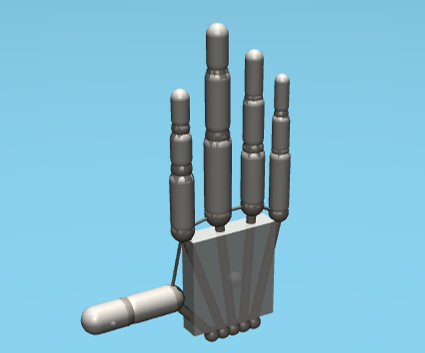
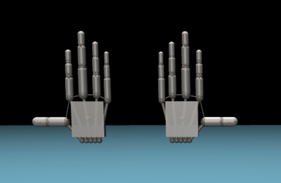
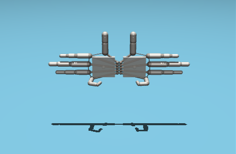
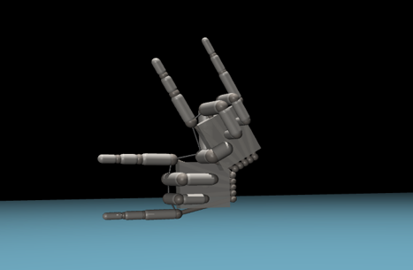
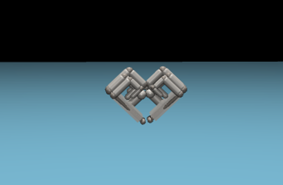

# mujoco_robohand
# Purpose
This code implements the model of RoboHand to mimic the movements of a human hand and consists of:

1. RoboHand model in MuJoCo.
2. RoboHands (both: left and right) model in MuJoCo.
3. Example code: Ball-Catching Operation.
# Model Images

| Static RoboHand | Ball-Catching Operation (Demo) |
|:---------------:|:------------:|
|   |   |

# Model Demo

*GIF animations may require a tap to play on mobile devices. For automatic playback, please use the desktop version.

# Usage
### Instructions:
To work with this model you have to:
1. Clone this repository.
2. Launch terminal in VS Code.
3. Install dependencies: `pip install -r requirements.txt`
4. Run demo version `src/ball_catching.py` 

---
*If you want to work with model as a separative object you need to do the step 1-2 and then instead of running demo version run the command:* 
`python -m mujoco.viewer` 
 
Now you can change the settings in real-time to see how it works and create your own configurations.
# Tips
- Don't forget to add joint type "free" for the base body and change the **gravitation options**, if you need to move it
- To improve control in complex manipulation systems just **add more sensors to the finger tips**
---
Employ a dual-hand configuration when you need to:
- **Mimic symmetrical movements** simultaneously.
- **Coordinate complex object manipulation** (passing, rotating, assembling).
- **Study inter-hand coordination** and synchronization.
- **Implement bimanual tasks** from human demonstration.
# Examples
Two robotic hands enable the creation of complex geometric shapes and artistic figures:
| Static 2 RoboHands | Crab |
|:---------------:|:------------:|
|   |   |
| Rock | Heart |
|   |   |
  

  # Model Demo
  

